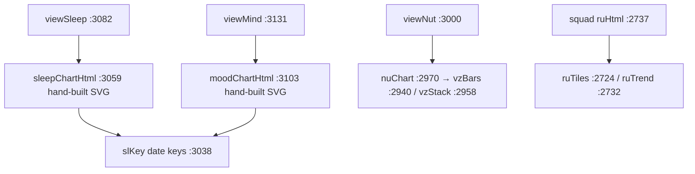

# Readiness charts (current)

```mermaid
flowchart TD
  SL[viewSleep :3082] --> C1[sleepChartHtml :3059 hand-built SVG]
  MI[viewMind :3131] --> C2[moodChartHtml :3103 hand-built SVG]
  NU[viewNut :3000] --> C3[nuChart :2970 → vzBars :2940 / vzStack :2958]
  SQ[squad ruHtml :2737] --> C4[ruTiles :2724 / ruTrend :2732]
  C1 & C2 --> K[slKey date keys :3038]
```
