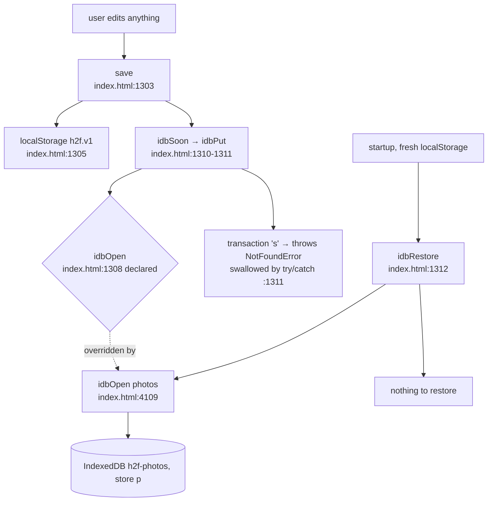

# Storage & backup (current)

```mermaid
flowchart TD
  A[user edits anything] --> B[save<br/>index.html:1303]
  B --> C[localStorage h2f.v1<br/>index.html:1305]
  B --> D[idbSoon → idbPut<br/>index.html:1310-1311]
  D --> E{idbOpen<br/>index.html:1308 declared}
  E -. overridden by .-> F[idbOpen photos<br/>index.html:4109]
  F --> G[(IndexedDB h2f-photos, store p)]
  D --> H[transaction 's' → throws NotFoundError<br/>swallowed by try/catch :1311]
  I[startup, fresh localStorage] --> J[idbRestore<br/>index.html:1312] --> F
  J --> K[nothing to restore]
```
Measured: after `save()`, `indexedDB.databases()` lists only `h2f-photos`; `h2f-state` is never created.
